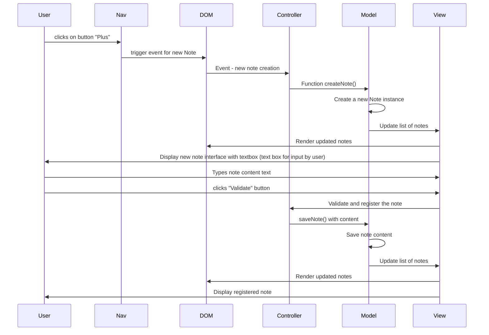
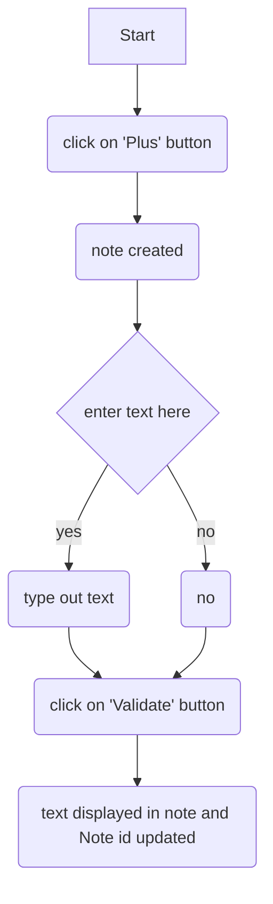
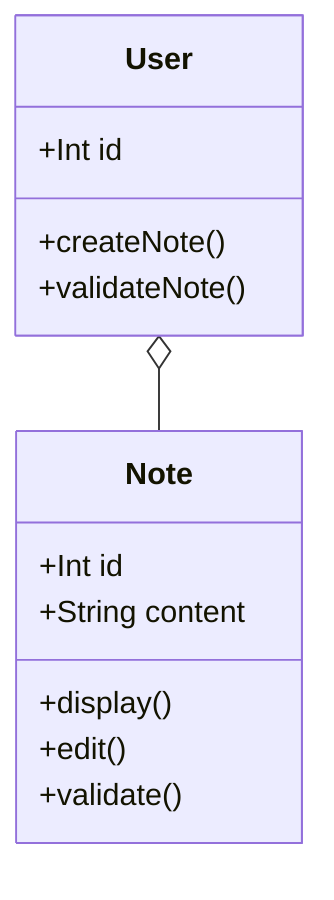

# 6_Sexta 
## Retro Engineering Exercise

## Methodology
1. Clone `https://gitlab.com/Nasyourte/exo-retroengineering`

2. Explore the application. Run the application to observe and note the different features and workflows.

3. For this exo I have used Draw.io, Mermaid and Figma.

## Screen states

* `plus` button, `header`
* Upon click, `plus` creates a new note
* note can be edited via input field
* note is saved and displayed

## 1. Use cases and Scenarios
### Indentifying the use cases.

1. Creating a new note

    * Actor : User
    * Description : User clicks `plus` button to create a new note
    * pre condition : User is on main app screen
    * post condition : a new note is created and displayed in the notes list

2. View all notes

    * Actor: User
    * Description: User views list of all notes

### Scenarios

#### UC 1

1. User clicks `PLUS` button
2. Note opens with text area for note
3. User enters text and clicks `VALIDATE`
4. note appears in notes list

#### UC 2

1. User navigates to the main application screen
2. All existing notes are displayed in the notes container

### Use case diagrams

## 2.Sequence Diagram

### Explanation of the Sequence

1. **User Interaction**:
    - The **User** clicks the "Plus" button in the nav , signaling intent to create a new note.
2. **Navigation Handling**:
    - The **Nav** component captures this click and triggers an event, notifying the DOM (Document Object Model).
3. **DOM Event Trigger**:
    - The **DOM** forwards this event to the **Controller**, indicating that the user wants to create a new note.
4. **Controller Action**:
    - The **Controller** calls the `createNote()` function on the **Model** to initiate the creation of a new note.
5. **Model Processing**:
    - The **Model** creates a new **Note** instance, which represents the note data.
    - This might involve initializing attributes like ID, content, created date, etc.
6. **Updating the View**:
    - Once the note is created, the **Model** sends an update to the **View** to reflect the new state of the notes list.
7. **Rendering to DOM**:
    - The **View** interacts with the **DOM** to render the updated list of notes, including the new note interface.
8. **User Interface Update**:
    - Finally, the **View** displays the new note interface to the **User**, allowing them to enter content for the new note.

### Activity Diagram

## 3. Class Diagram

User creates and manages Note instances.
The `o--` relationship indicates that Note depends on User. A note cannot exist without being associated with a user.

when a user is created, they can create and manage their own notes, and if the user is deleted, the associated notes may also be removed, emphasizing the relationship.

## Wireframe

Wireframe created for the interface of the app to reflect its various states:

#### Button
allows users to add a new note. It is fixed in position to remain accessible as users scroll through notes.

**Interaction:**
Upon click, button creates a new note.

**Additional Interactions**
On hover, button `Plus` and button `Validate` change colour to
slightly darker.
`Plus` button moves depending on screen size.

#### Header section
This is the main title of the application.
**NOTE APP** displayed at the top of page.

#### Main Content Area
Element: Notes Container.
This area will display the list of notes created by the user.

#### Individual Note Entries
Element: default note entry.
Note is created when `plus` button is clicked.

**Interaction:**
when note clicked, text entry prompted upon creation of the card.
`Validate` button is clicked to save the entry.
text field can be expanded with bottom right bars.
Once validated, note number turns green.