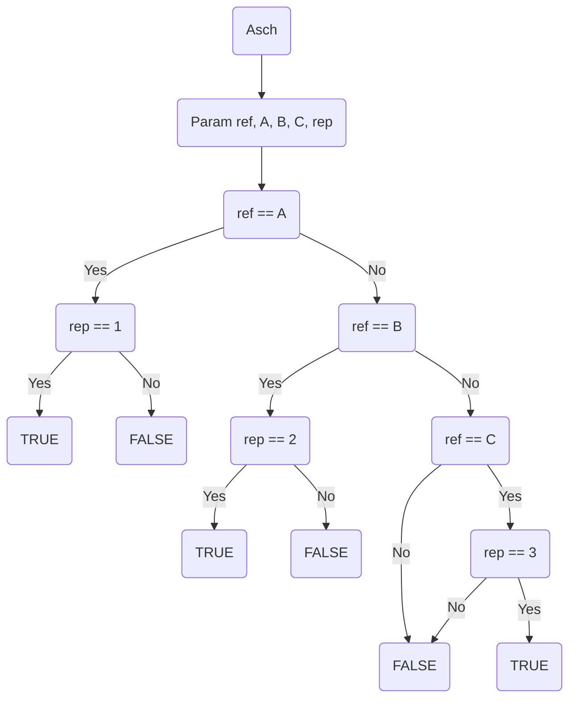

# 8_OctavIA

In this exercise, we create a machine learning model using a decision tree to simulate the Asch conformity experiments.

purpose of this exo:

is to investigate the extent to which social pressure from majority group could influence a person to conform.

Dataset consists of different reference lengths (ref) and the three comparison lengths (A, B, C), with the participant's response (rep), indicating whether they selected the correct comparison length or conformed to the group.

## Alpha
defining the dataset and decision tree model without code

#### INPUT data model
the model takes the following inputs:
* **ref**: reference length
* **A**: comparison length A
* **B**: comparison length B
* **C**: comparison length C
* **rep**: reponse, answer (1,2,3) corresponding to the chosen comparison length by participant (A,B,C)

#### OUTPUT data model
* **True / False**: whether the reponse answer of the participant is correct based on Ref

#### Decision tree model that I think would give the correct answer each time



## Beta
implement decision tree with training and testing datasets

### Training data set
containing 40 entries with correct answers.

### Loading the dataset
```python
import csv 
with open('8_octavia_train_40.csv') as csvfile:
    df1 = list(csv.reader(csvfile))
```
### Preparing and preprocessing the dataset
The dataset contains both numeric values and boolean values.
As the model only accepts numeric values, I mapped the boolean values `True` to become `1` and `False` to become `0`.

```python
df1 = df1[1:]	#removes header

df1_temp = []	#doesnt change original table , so creates temp table

for l in df1:
    l_temp = []
    for case in l:
        if case == "true":
            l_temp.append(1)
        else:
            l_temp.append(int(case))	#convert to int
    df1_temp.append(l_temp)

df1 = df1_temp	#updates original datasheet
```

### Decision Tree function
```python
# Function to simulate the Asch experiment and determine validity
def asch(ref, A, B, C, rep):
    if ref == A:
        if rep == 1:
            return True
        else:
            return False
    elif ref == B:
        if rep == 2:
            return True
        else:
            return False
    elif ref == C:
        if rep == 3:
            return True
        else:
            return False
    return False
```

### Model training
training the Decision Tree Classifier to predict whether response is valid (true) or not (false)

The model uses the features ref, A, B, C, and rep to predict the output.

```python
import pandas as pd
from sklearn import tree
from sklearn.tree import DecisionTreeClassifier
import matplotlib.pyplot as plt

df2 = pd.read_csv("8_octavia_train_35.csv")

features = ['ref','A','B','C','rep']	#features used for prediction

df2["valid"] = df2["valid"].map({True: 1, False: 0})

inputs = df2[features]
outputs = df2['valid']

dtree = DecisionTreeClassifier()
dtree = dtree.fit(inputs, outputs)  #fit means train
```

### Visualise the Decision Tree
after training the model, I visualise the decision tree to understand how it makes decisions

```python
from sklearn.tree import plot_tree

tree.plot_tree(dtree, feature_names=features)
plt.show()
```


### Testing the model
I load the test dataset (10 entries) and use the trained decision tree to make predictions on the test data.

```python
df3 = pd.read_csv("8_octavia_asch_test_dataset_10.csv")

df3["valid"] = df3["valid"].map({True: 1, False: 0})

# Prepare inputs and outputs for the test set
inputs_test = df3[features]
outputs = df3['valid']

#predit is use
print(dtree.predict(inputs_test))
```

## Generating Dataset
I made the following script to generate the baseline dataset. Here it is for correct responses

```python
import random
import pandas as pd

#Generate 10 random test cases that are true
octavia_test = []

for i in range(10): 
    values = [random.choice(range(1, 25)) for j in range(3)]
    A, B, C = values
    ref = random.choice(values)
    rep = values.index(ref) + 1		# +1 because rep should be 1, 2, or 3

    valid = asch(ref, A, B, C, rep) #valid True if rep correctly identifies which of A, B, or C matches ref, and False otherwise.
    octavia_test.append([ref, A, B, C, rep, valid])

#create df for test dataset
columns = ['ref', 'A', 'B', 'C', 'rep', 'valid']
test_df = pd.DataFrame(octavia_test, columns=columns)

# Show the test dataset
print(test_df)

# save the test dataset 
test_df.to_csv('8_octavia_asch_test_dataset_10.csv', index=False) #index false means index generated by pandas wont be saved in ds
```

## Gamma
explore the impact of training data with error rates.

90% (36) incorrect answers in the training dataset. compare the decision trees

Using the script described above, I generate a dataset where all responses are correct, then introduce errors 

```python
import random
import pandas as pd

#import Asch function

# Function to introduce errors in the dataset
def introduce_errors(df, error_rate):
    df_with_errors = df.copy()
    num_errors = int(len(df) * error_rate)  # Calculate number of errors based on error rate
    
    # Randomly select rows to introduce errors
    error_indices = random.sample(range(len(df)), num_errors)
    
    for i in error_indices:		# Flip the 'valid' column (True <-> False)
        df_with_errors.at[i, 'valid'] = not df_with_errors.at[i, 'valid']
    return df_with_errors

# Generate 40 random test cases that are incorrect
octavia_train = []

for i in range(40): 
    values = [random.choice(range(1, 25)) for j in range(3)]
    A, B, C = values
    ref = random.choice(values)
    rep = values.index(ref) + 1  
    
    valid = asch(ref, A, B, C, rep) 
    octavia_train.append([ref, A, B, C, rep, valid])

# Create DataFrame for test dataset
columns = ['ref', 'A', 'B', 'C', 'rep', 'valid']
train_df_error = pd.DataFrame(octavia_train, columns=columns)

# Save the test dataset (baseline with correct responses)
train_df_error.to_csv('8_octavia_asch_train_dataset_40_false.csv', index=False)

# Show the test dataset
print(train_df_error)
```

introduce_errors function to flip the valid responses and simulate different error rates.
```python
error_rate = 0.90
df_with_errors = introduce_errors(test_df, error_rate)
df_with_errors.to_csv('8_octavia_asch_test_dataset_with_errors_90.csv', index=False)
print(df_with_errors)
```
repeat decreasing by 5%(2) each time the error rate 

for each iteration, I train a new decision tree and compare its performance with the previous model.

This helps understand how the decision tree's accuracy is impacted by the quality of the training data

what is the conclusion?

error sensitivity - Decision tree is highly sensitive to quality of training data. As error rate increases, model's performance deteriorates.

Model behaviour - even with a high error rate in the training data, Decision tree still manages to find patterns, but becomes less accurate in predicting the correct responses