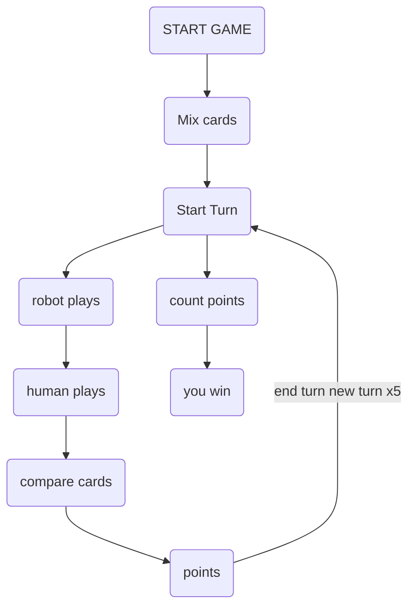

# 9_Nona
Card game simulation between Robot and Human.

## Game rules
* no. of rounds: 5
* game uses deck of cards, each with a value and a suit
* each round, each player chooses 1 card from their hand
* player with highest card value wins round
* player with max round wins


## Strategies
I have decided to keep the strategies in a separate file for clarity called `strat.py`

### Random card strategy
player selects random card from hand
```python
import random

def random_card(state):
    #human
    if state["card_robot"] != None: 
        #i play a random card
        for card in state["hand_human"]:
            card = random.choice(state["hand_human"])
            state["hand_human"].remove(card)
            return card
    else: 
        #robot
        carte = random.choice(state["hand_robot"])
        state["hand_robot"].remove(carte)
        return carte
```
### Biggest card strategy
player selects highest value card from hand
```python
def max_card(state):
    #human
    if state["card_robot"] != None:
        #i play max card
        for card in state["hand_human"]:
            card = max(state["hand_human"])
            state["hand_human"].remove(card)
            return card
    else:
        #robot
        carte = max(state["hand_robot"])
        state["hand_robot"].remove(carte)
        return carte
```
### Smallest card strategy
player selects smallest value card from hand
```python
def min_card(state):
    #human
    if state["card_robot"] != None:
        #i play max card
        for card in state["hand_human"]:
            card = min(state["hand_human"])
            state["hand_human"].remove(card)
            return card
    else:
        #robot
        carte = min(state["hand_robot"])
        state["hand_robot"].remove(carte)
        return carte
```

## Function definition
### `play` function

`play()` simulates a single game between the robot and the human.

It accepts 2 strategies as parameters `play(strategy_robot, strategy_human)`

**Parameters:**
* strategy_robot: robot card selection strategy.
* strategy_human: human card selection strategy.

**Returns:**
dictionary with the following keys:
* human_strategy_name: Name of the human's strategy.
* robot_strategy_name: Name of the robot's strategy.
* winner: "human" or "robot" depending on the winner of the game.

using a dictionary allows to return the State at the beginning and the end of the game

```python
def play(strategy_robot, strategy_human):
    random.shuffle(all_cards)   #mix cards

    state = {
        "hand_robot": all_cards[:5], #split in half distribute in 2 variables human and robot
        "hand_human": all_cards[5:],
        "point_robot": 0,
        "point_human": 0,
        "turn": 0,
        "card_robot": None,
        "card_human": None,
        "winner": ""
    }
    
    for i in range(1, 6):       #loop 5 times
        state["turn"] += 1
        state["card_robot"] = None
        state["card_human"] = None
        state["card_robot"] = strategy_robot(state)
        state["card_human"] = strategy_human(state)
        
        if state["card_robot"] >= state["card_human"]:
            state["point_robot"] += 1
        else:
            state["point_human"] += 1
    
    if state["point_robot"] > state["point_human"]:
        state["winner"] = "ROBOT"
    else:
        state["winner"] = "HUMAN"
    return state
```
### `plays` function
`plays()` runs multiple games.

**Parameters:**
* n: number of games
* strategy_robot: robot card selection strategy.
* strategy_human: human card selection strategy.

**Returns:**
* results of each game
* wim ratio for the robot as %

```python
def plays(n, strategy_robot, strategy_human):            
    all_games = []
    win_count = {"ROBOT": 0, "HUMAN": 0}

    for j in range(n):
        result = play(strategy_robot, strategy_human)   #storing result from play function
        all_games.append(result)
        win_count[result["winner"]] += 1
    return all_games, win_count
        
n = 1000        
n_games, n_wins = plays(n, strat.random_card, strat.random_card)
# = plays(10000, strat.random_card, strat.random_card)

robot_win = n_wins["ROBOT"]
human_wins = n_wins["HUMAN"]
win_ratio = (robot_win / n) * 100

print(f"Robot win ratio for 1000 games: {win_ratio} %")

n = 10000
n_games, n_wins = plays(n, strat.random_card, strat.random_card)
win_ratio_10000 = ((n_wins["ROBOT"]) / n) * 100

print(f"Robot win ratio for 10,000 games: {win_ratio_10000} %")
```